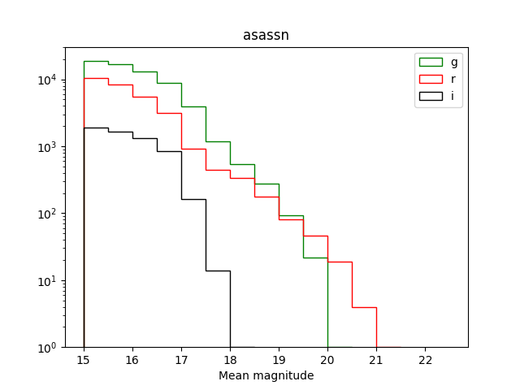
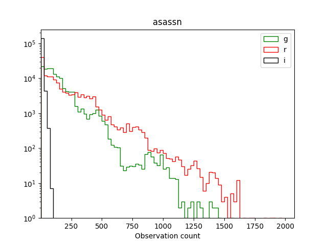
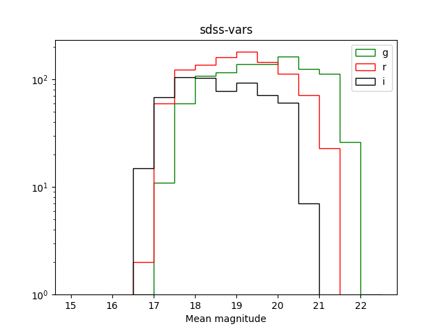
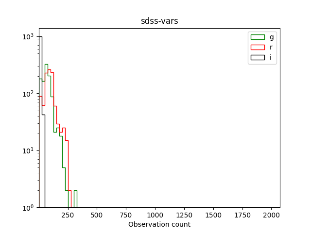
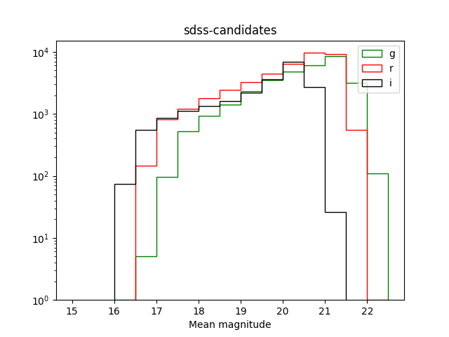
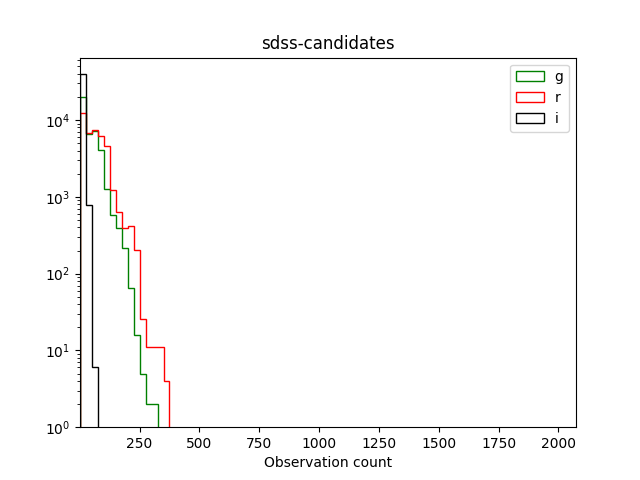
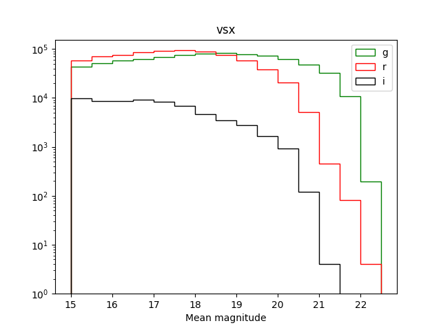
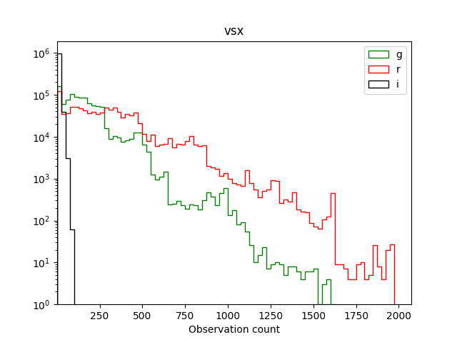

# Cross-matching of ZTF DR3 with variable star catalogues

This project is dedicated to obtain an ML training set of ZTF variable star light curves by cross-matching ZTF DR3 with variable star catalogues.
[Clickhouse](https://clickhouse.tech) database is used to perform cross-matching, cone search is made by hierarchical hexagonal hash ([h3](https://github.com/uber/h3)).

### Available data-sets

##### [ASAS-SN variable star catalogue](https://asas-sn.osu.edu/variables)

- <https://static.rubin.science/ztf-asassn.csv.xz>
- 142 631 / 666 502 objects
- 200 MB compressed / 1665 MB uncompressed

This repo contains a copy of the catalogue dated by 2019-10-20 at `/ch_vars/data/asassn-catalog-20191020.csv.bz2`. The catalogue is filtered to contain objects with `class_probability > 0.9`. Cross-matching is performed to find ZTF objects within 1 arcsec from ASAS-SN objects and with difference of mean ZTF `g` magnitude and ASAS-SN `V` magnitude not large than ASAS-SN `V` magnitude amplitude plus unity.

##### [SDSS Stripe 82](https://wbhatti.org/notes/stripe82-variables-drnotes.html)

**Classified variables:**
- <https://static.rubin.science/ztf-sdss-vars.csv.xz>
- 1033 / 1162 objects
- 1 MB compressed / 7 MB uncompressed

**Unclassified variables:**
- <https://static.rubin.science/ztf-sdss.csv.xz>
- 40 456 / 45 822 obects
- 24 MB compressed / 169 MB uncompressed

Two data-sets obtained by 1 arcsec cross-matching of classified (the first link) and unclassified (the second link) variables found by Waqas Bhatti in SDSS Stripe 82 data. The list of classified variables contain 1162 objects while unclassified list (which is almost a superset of the classified) contains 45 822 objects. 

##### [AAVSO VSX](https://www.aavso.org/vsx/)

- <https://static.rubin.science/ztf-vsx.csv.xz>
- 1 045 293 / 2 104 068 objects
- 2.29 GB compressed / 18.2 GB uncompressed

2020-10-05 version of VSX from Vizier is used. All VSX objects with minimum magnitude brighter 12 and maximum magnitude brighter 10 are filtered. 1 arcsec cross-matching is performed. 
